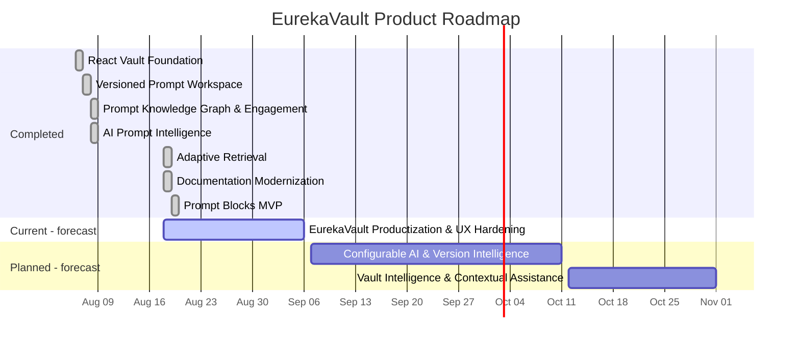
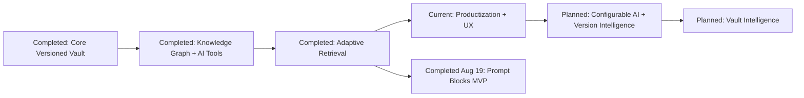
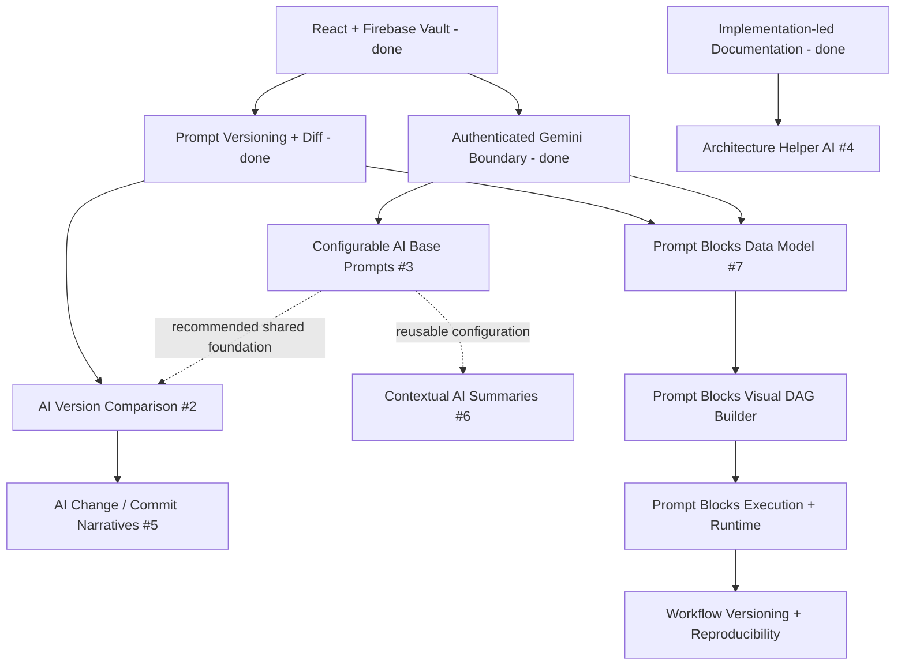

# EurekaVault — React Release 1 Foundation

A private, version-controlled workspace for Prompts, methodologies, preferences, Prompt lineage, and AI-assisted Prompt intelligence.

## Stack

- React 19 + TypeScript
- Vite 8
- Firebase Authentication + Realtime Database
- Motion for accessible layout, page, drawer, and dialog animation
- React Router
- Lucide icons
- Sonner notifications
- Netlify Functions for server-side Gemini access
- Spring Boot 4.1 / Java 21 migration backend (incremental 3-tier foundation)

## Run locally

```bash
npm install
npm run dev
```

Production validation:

```bash
npm run lint
npm run test
npm run build
```

### CI/CD safety gate

Before functional migration continues, GitHub Actions now validates both tiers. Frontend CI runs ESLint, the Vitest suite, the production Vite build, and Netlify Function syntax checks. Backend CI runs Maven `clean verify`, Spring integration tests, then builds and boots the actual Docker image and verifies `/actuator/health`.

Production deployment is designed to occur only after successful CI on `main`: GitHub Actions triggers Netlify and Render through protected deployment hooks. See `docs/CI-CD.md`, `docs/TESTING.md`, and `docs/DEPLOYMENT.md` for the complete contract and required host settings.

### Spring Boot migration backend

The first incremental 3-tier migration step lives under `backend/`. It currently exposes infrastructure health only; existing Firebase CRUD and Netlify AI behavior are intentionally unchanged.

```bash
cd backend
mvn spring-boot:run
```

Health endpoint:

```text
http://localhost:8080/actuator/health
```

## Firebase setup

The supplied Firebase project configuration is included as a fallback in `src/lib/firebase.ts`. The public Firebase web configuration is safe to ship, but database access must be enforced by server-side Realtime Database rules.

Merge `database.rules.json` with the project's existing rules. The important owner-only branch is:

```json
"intellectVault": {
  "users": {
    "$uid": {
      ".read": "auth != null && auth.uid === $uid",
      ".write": "auth != null && auth.uid === $uid"
    }
  }
}
```

Enable Email/Password in Firebase Authentication.

## Implemented product areas

- Account creation, sign-in, sign-out, verification email, and password reset
- Owner-private Firebase workspace
- Direct `Endeavor → Task → Prompt → Prompt Version` hierarchy
- Automatic Prompt-local version history for Prompt creation and saved edits
- Git-style Prompt version comparison and historical restore-as-new-version behavior
- Prompt file attachments with per-file, per-Prompt count, and aggregate size limits
- Explicit `inspired-by / inspires` Prompt lineage with cycle prevention and exportable relationship maps
- Mindsets, Preferences, deterministic Mindset Construction, Decisions, Archive, and Global Versions
- Activity tracking and Achievements
- Vault-wide Prompt search, command palette, responsive navigation, and light/dark/system themes
- Gemini-backed Semantic Prompt Finder, Prompt Repurposer, Prompt Mixer, and Prompt Blocks through authenticated Netlify Functions
- Prompt Blocks visual Prompt-transformation DAG with typed content/constraint flow, explicit priority, inspectable intermediate values, quick/saved pipelines, current/pinned Prompt references, and branching outputs
- Editable Prompt Blocks transformation prompts seeded once into Firebase and thereafter treated as database-controlled behavior
- Finder feedback learning: user-confirmed search → Prompt mappings become bounded few-shot retrieval examples

## Not implemented / decision-gated

Prompt Blocks MVP is now implemented in this delivery. Dedicated pipeline-local automatic version history remains a future extension; saved definitions are already included in Global Version snapshots and workspace export.


- Markup-defined hierarchy parsing — blocked by unresolved markup-format decisions
- Collaboration — blocked by unresolved ownership, permissions, synchronization, and conflict semantics
- Formal Mindset inheritance/conflict rules and Preference precedence rules remain open architectural decisions

# Product Roadmap

> **Roadmap snapshot:** repository `main` at `3b61d705` on August 18, 2026. Historical dates are repository facts. Future dates and percentages below are analytical estimates and are explicitly labeled as such.

## Current Product Phase

**Phase 4 — Productization & Intelligence Expansion (current).**

EurekaVault already has a functional versioned Prompt vault and three production-shaped Gemini workflows. The current repository evidence shows the product moving from rapid capability construction into productization: documentation modernization, the EurekaVault rebrand, UX cleanup, and establishment of a maintainable planning system before the next AI-intelligence and workflow-orchestration layers.

## Completed Major Milestones

| Milestone | Completed | Outcome |
|---|---|---|
| React Vault Foundation | Aug 6, 2026 | React/TypeScript/Vite + Firebase authentication/private persistence + core CRUD lifecycle |
| Versioned Prompt Workspace | Aug 7–8, 2026 | Prompt copying, automatic history, Mindset Construction, major UX overhaul, Git-style diffs |
| Prompt Knowledge Graph & Engagement | Aug 8, 2026 | Attachments, relationships/map, activity tracking, achievements |
| AI Prompt Intelligence | Aug 8, 2026 | Semantic Finder, Repurposer, Mixer, then arbitrary pasted Mixer sources |
| Adaptive Retrieval | Aug 18, 2026 | Finder learns from explicitly confirmed query → Prompt choices |
| Documentation Modernization | Aug 18, 2026 | Comprehensive implementation-led technical documentation added to `docs/` |

## Current Milestone

### EurekaVault Productization & UX Hardening

**Status:** Active — analytically inferred from the latest commit and open backlog.  
**Estimated progress:** ~30% (**estimate, low/medium confidence**).  
**Estimated completion window:** **Aug 24–Sep 6, 2026** (**forecast, low confidence**).

Primary scope:

- #1 finish roadmap/planning documentation and remove remaining public documentation drift;
- #8 reproduce and fix the New Prompt lingering UI defect;
- #9 complete the EurekaVault identity change beyond the current “part1” commit;
- #10 refine and implement the requested frontend animation/theme overhaul without regressing existing responsive/theme behavior.

## Planned Milestones

| Milestone | Evidence | Estimated completion window | Confidence | Primary objective |
|---|---|---|---|---|
| Configurable AI & Version Intelligence | Issues #2, #3, #5 | Sep 21–Oct 11, 2026 | Low | User-configurable AI building prompts plus AI-assisted version/change interpretation |
| Vault Intelligence & Contextual Assistance | Issues #4, #6 | Oct 12–Nov 1, 2026 | Low | Architecture-aware helper AI and contextual Prompt summaries in the vault UI |
| Prompt Blocks MVP | Implemented Aug 19, 2026 | Completed | High | Typed Prompt-processing DAG, editable transformation prompts, reusable saved pipelines, deterministic execution, intermediate inspection and branching outputs |

Markup parsing and collaboration remain confirmed long-term decision gates, but no delivery dates are assigned because their product/architecture decisions are still unresolved and no GitHub Issues currently define executable scope.

## Strategic Initiatives

1. **Product Experience & Identity** — documentation, EurekaVault rebrand, usability defects, frontend quality.
2. **Prompt Intelligence & Explainability** — configurable AI instructions, version intelligence, architecture Q&A, contextual summaries.
3. **Executable Methodology** — Prompt Blocks is now implemented; future work can deepen methodology-local history, reproducibility metadata, and approved advanced routing without turning it into a generic agent graph.
4. **Decision-Gated Platform Expansion** — markup parsing, collaboration, inheritance/precedence semantics, workspace deletion policy.

## Timeline

<!-- ROADMAP-GANTT:START -->

<!-- ROADMAP-GANTT:END -->

## Milestone Progress

```text
Productization & UX Hardening          ███░░░░░░░  ~30% estimated
Configurable AI & Version Intelligence ░░░░░░░░░░    0% repository evidence
Vault Intelligence & Assistance        ░░░░░░░░░░    0% repository evidence
Prompt Blocks MVP                      ██████████  100% implementation delivery
```

## Planned vs. Completed



## Major Dependencies



## Roadmap Sources

The concise roadmap above is generated from maintainable planning sources rather than acting as the only source of truth:

- [`docs/roadmap/README.md`](docs/roadmap/README.md) — roadmap maintenance guide
- [`docs/roadmap/product-audit.md`](docs/roadmap/product-audit.md) — full historical/product audit
- [`docs/roadmap/github-milestones.md`](docs/roadmap/github-milestones.md) — proposed milestone/issue structure
- [`docs/roadmap/roadmap.yaml`](docs/roadmap/roadmap.yaml) — current phase and forecast source
- [`docs/roadmap/milestones.yaml`](docs/roadmap/milestones.yaml) — milestone definitions and dates
- [`docs/roadmap/initiatives.yaml`](docs/roadmap/initiatives.yaml) — strategic initiative hierarchy
- [`docs/roadmap/issue-mapping.yaml`](docs/roadmap/issue-mapping.yaml) — open-issue classification/mapping
- [`docs/roadmap/weekly-velocity.yaml`](docs/roadmap/weekly-velocity.yaml) — week-by-week delivery dataset
- [`docs/roadmap/weekly-velocity.svg`](docs/roadmap/weekly-velocity.svg) — generated velocity visualization

## Data root

```text
intellectVault/users/{firebaseUid}/
```

See `docs/ARCHITECTURE.md`, `docs/DECISION_LOG.md`, and `docs/roadmap/README.md`.
