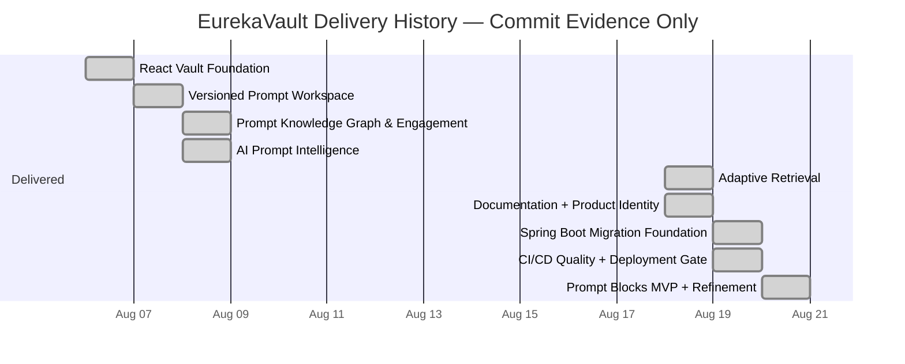

# EurekaVault

A private, version-controlled workspace for Prompts, methodologies, preferences, Prompt lineage, and AI-assisted Prompt intelligence.

> **Evidence baseline:** GitHub `main` at `7e45248a408e372088d18cab74faef5a79523075` (commit date: 2026-08-20 UTC). This package contains a documentation/RoadmapPage cleanup on top of that baseline and does not invent a replacement commit SHA. Roadmap status is derived from actual GitHub Issues/labels and commit evidence; it does **not** invent delivery dates, priorities, percentages, or future commitments.

## Stack

- React 19 + TypeScript + Vite 8
- Firebase Authentication + Realtime Database
- Motion, React Router, Lucide, and Sonner
- Netlify Functions for the currently deployed Gemini boundary
- Spring Boot 4.1 / Java 21 backend foundation for the explicit 2-tier → 3-tier migration
- GitHub Actions quality gates and gated Netlify/Render deployment hooks

## Run locally

```bash
npm install
npm run dev
```

Production validation:

```bash
npm run lint
npm run test
npm run build
```

Spring Boot backend foundation:

```bash
cd backend
mvn spring-boot:run
```

Health endpoint:

```text
http://localhost:8080/actuator/health
```

## Current architecture boundary

EurekaVault is **not yet fully 3-tier**. The migration requested in GitHub Issue #12 has started, and the Spring Boot service exists, but current application traffic still has two legacy paths:

```text
React client
  ├─ Firebase Authentication + Realtime Database   (vault CRUD still direct)
  ├─ Netlify Functions → Gemini                    (AI calls still here)
  └─ Spring Boot on Render                         (migration foundation / health today)
```

The repository therefore distinguishes the **deployed backend foundation** from the **unfinished functional migration** rather than calling the migration complete.

## Implemented product areas

- Account creation, sign-in/sign-out, verification email, and password reset
- Owner-private Firebase workspace
- Direct `Endeavor → Task → Prompt → Prompt Version` hierarchy
- Automatic Prompt-local version history and historical restore-as-new-version behavior
- Git-style Prompt version comparison
- Prompt file attachments
- Directed `inspired-by / inspires` Prompt lineage with cycle prevention and map export
- Mindsets, Preferences, deterministic Mindset Construction, Decisions, Archive, and Global Versions
- Activity tracking and Achievements
- Vault-wide Prompt search, command palette, responsive navigation, and themes
- Gemini-backed Semantic Prompt Finder, Prompt Repurposer, and Prompt Mixer
- Finder feedback learning from explicit user-confirmed query → Prompt mappings
- Prompt Blocks typed visual DAG with saved/quick pipelines, current/pinned Prompt references, typed content/constraint flow, explicit priority, branching, inspectable intermediates, and explicit output saving
- Prompt Blocks refinements from Issues #17/#18: compact IDE-style controls, deterministic beautification, print layout, output-intent warning, and reachable/scrollable final run output
- EurekaVault identity work including the epsilon mark, Alexandrian lighthouse motif, Greek identity copy, and the light-blue/gold/royal-red palette
- Spring Boot/Render migration foundation
- CI/CD quality gates and deployment gating

## GitHub-backed roadmap

The repository currently has **no GitHub Milestones configured**. The canonical future-scope evidence is the set of user-created GitHub Issues. The `epic` label is present on exactly these five issues in the inspected snapshot:

| Epic | GitHub state | Implementation evidence |
|---|---|---|
| #3 — Base prompts modification/customization + revision history | Open | **Partial only:** Prompt Blocks transformation prompts are editable Firebase records, but the broad cross-feature epic is not implemented. |
| #4 — Architecture helper AI | Open | No implementation evidence found. |
| #7 — Prompt Blocks | Open | **MVP implemented** by `b556e64`; workspace refinements landed in `7e45248`. The open Issue contains broader ideas beyond the implemented MVP and is not treated as a promise to build every idea in it. |
| #11 — CI/CD | Open | **Core implemented** by `3d2bfa9`, `54373c9`, and follow-up CI fixes. |
| #12 — 2-tier → 3-tier | Open | **In progress:** Spring Boot foundation introduced by `4a3cc23`; the Issue comment explicitly chooses Spring Boot. Functional data/AI migration is not complete. |

Other open Issues remain individual bugs, enhancements, product work, or design questions. They are listed without invented sequencing in [`docs/roadmap/issue-mapping.yaml`](docs/roadmap/issue-mapping.yaml).

### Commit-backed delivery history

<!-- ROADMAP-GANTT:START -->

<!-- ROADMAP-GANTT:END -->

This chart is historical. It deliberately contains **no future bars**.

## Open Issue backlog — no inferred schedule

As of the snapshot, Issues #1–#18 are open on GitHub. Several have implementation evidence despite remaining open, so the repository does not equate “open” with “not implemented.” In particular, #7, #11, #17, and #18 have substantial or direct implementation evidence.

The following are explicitly **not promoted into roadmap commitments** merely because they appeared in older generated documentation: markup-defined hierarchy parsing, collaboration, formal Mindset inheritance rules, Preference precedence systems, and workspace deletion initiatives. They have no corresponding GitHub Issue/epic in this snapshot and are removed from the roadmap.

## Roadmap source files

- [`docs/roadmap/README.md`](docs/roadmap/README.md) — evidence and maintenance policy
- [`docs/roadmap/roadmap.yaml`](docs/roadmap/roadmap.yaml) — repository snapshot and planning facts
- [`docs/roadmap/initiatives.yaml`](docs/roadmap/initiatives.yaml) — **actual GitHub epics only**
- [`docs/roadmap/issue-mapping.yaml`](docs/roadmap/issue-mapping.yaml) — Issues #1–#18 with implementation evidence
- [`docs/roadmap/milestones.yaml`](docs/roadmap/milestones.yaml) — retrospective delivery groups only; not GitHub Milestones
- [`docs/roadmap/generated-gantt.md`](docs/roadmap/generated-gantt.md) — generated historical delivery chart
- [`docs/roadmap/weekly-velocity.yaml`](docs/roadmap/weekly-velocity.yaml) — factual commit counts by calendar week
- [`docs/roadmap/product-audit.md`](docs/roadmap/product-audit.md) — evidence-based audit and scope cleanup
- [`docs/roadmap/github-milestones.md`](docs/roadmap/github-milestones.md) — actual GitHub planning state, including the fact that no GitHub Milestones exist

Regenerate the historical Gantt with:

```bash
npm run roadmap:gantt
```

## Firebase setup

The supplied Firebase web configuration can be overridden with environment variables. Database access must be enforced server-side by Realtime Database rules. The owner-scoped data root is:

```text
intellectVault/users/{firebaseUid}/
```

## Documentation

Start with [`docs/README.md`](docs/README.md). Architecture, AI boundaries, version control, deployment, security, implementation history, decisions, and feature-specific deep dives live under `docs/`.
