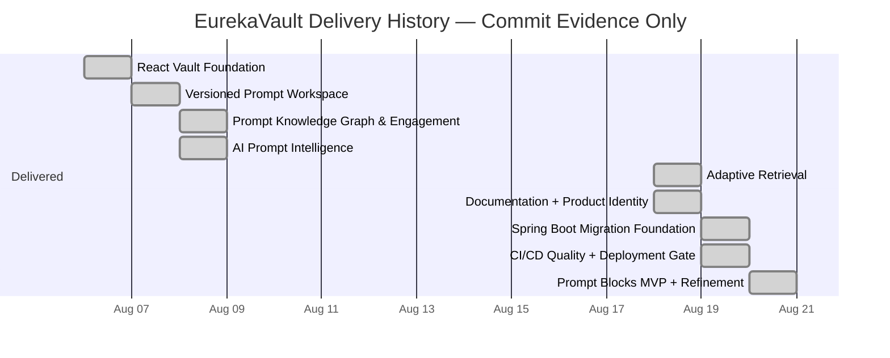

# Generated EurekaVault Delivery History

> Generated by `scripts/generate-roadmap-gantt.mjs` from retrospective commit-backed groups in `docs/roadmap/milestones.yaml`. It intentionally contains no future forecast or product commitment.

Historical delivery groups represented: **9**.

