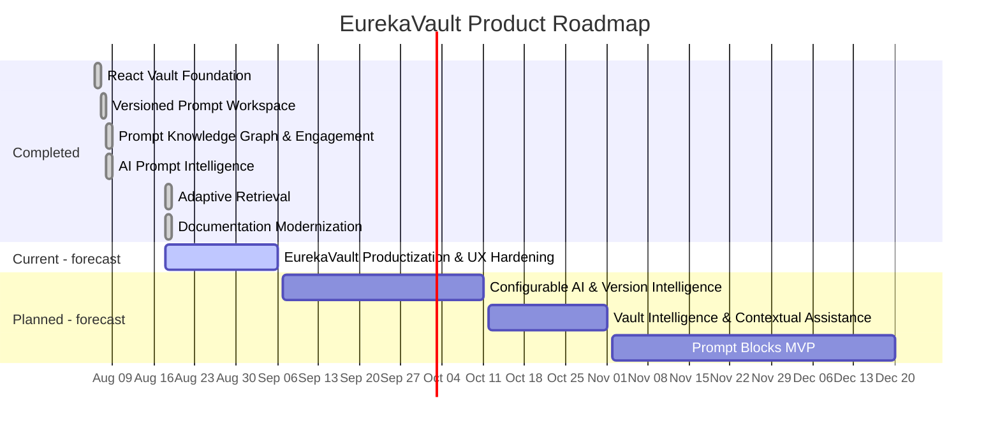

# Generated EurekaVault Roadmap Gantt

> Generated by `scripts/generate-roadmap-gantt.mjs` from `docs/roadmap/milestones.yaml`. Do not edit the task list manually.

Milestones represented: **6 completed**, **1 active**, **3 planned**.

