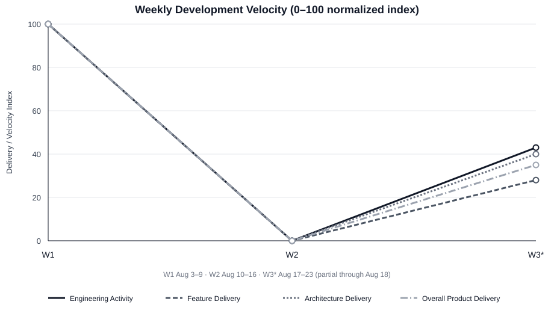
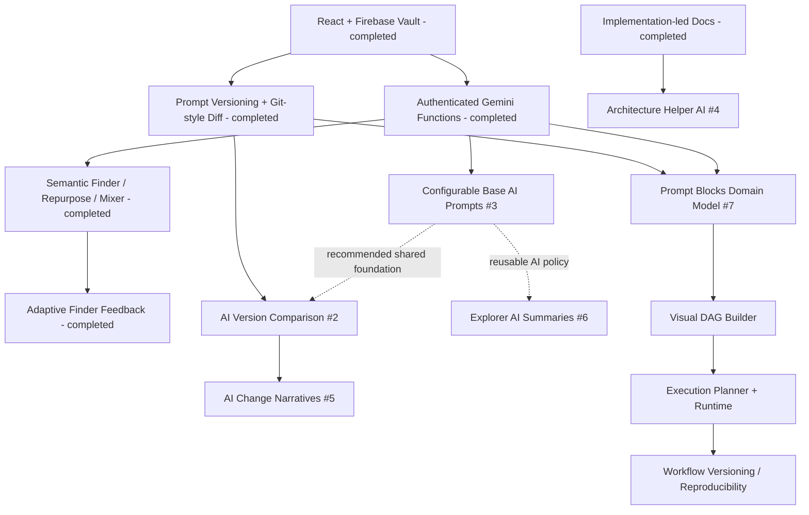
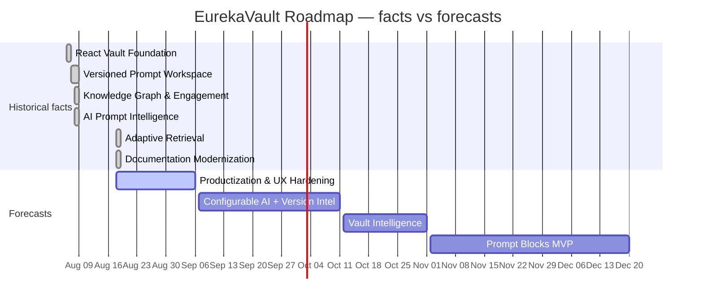

# EurekaVault Product Roadmap, Agile Velocity & Repository Audit

## 0. Audit boundary and evidence rules

This audit follows the repository-first methodology supplied by the product owner. The roadmap is a consequence of repository evidence rather than a list of desired features imposed on the repository.

**Repository:** `kirolossedra/Prompt-management`  
**Branch:** `main`  
**Snapshot commit:** `3b61d7050f905a5c591971f6e8ecbdc8588870ac` (`Eureka-Vault Name Rebrand issue #9 part1`)  
**Analysis cutoff:** 2026-08-18T12:39:00-04:00  
**Write policy:** GitHub inspection only. No Issue, label, branch, milestone, PR, or repository file was changed by this audit.

Evidence precedence:

1. current implementation at the snapshot;
2. Git history and commit diffs;
3. current open/closed GitHub Issues and their timestamps/content;
4. repository documentation and decision logs;
5. analytical inference, explicitly labeled;
6. recommendations, explicitly labeled and never presented as existing plans.

No product release number is inferred from `package.json` version `1.0.0`.

---

# 1. Full repository sweep

## 1.1 Current application shape

At the snapshot, EurekaVault is a React/TypeScript/Vite application backed by Firebase Authentication and Realtime Database. The authenticated workspace is owner-private beneath `intellectVault/users/{uid}`.

Current routed product surfaces include:

- Dashboard / Overview;
- Achievements;
- Vault hierarchy;
- Prompt library;
- Prompt workspace;
- Prompt Relationships and relationship map;
- Mindsets;
- deterministic Mindset Construction;
- Preferences;
- Semantic Prompt Finder;
- Prompt Mixer;
- Prompt Repurposer;
- Global Versions;
- Decisions;
- Archive;
- in-app Roadmap gates;
- Settings;
- Search.

## 1.2 Core domain and persistence

Current primary domain/persistence concepts include:

- workspace profile;
- Endeavors;
- Tasks;
- Prompts;
- Prompt Versions;
- Prompt Attachments;
- Prompt Relationships;
- Prompt Finder Feedback;
- Mindsets;
- Preferences;
- legacy Local Commit records;
- Global Version/Global Commit snapshots;
- Decisions;
- activity days/statistics;
- achievement unlocks.

The implemented content hierarchy is direct:

```text
Endeavor → Task → Prompt → Prompt Version
```

There is no current Folder entity despite the stale root README statement that mentioned nested folders.

## 1.3 Prompt workspace

The Prompt workspace is materially more than CRUD. It includes:

- editor;
- automatic history on saved changes;
- dirty-state tracking;
- Ctrl/Cmd+S support;
- copy Prompt content;
- duplicate Prompt with independent history;
- restore historical snapshot as a new current version;
- unified/side-by-side Git-style line diff;
- attachments;
- relationship editing;
- direct Repurpose and Mixer entry points.

## 1.4 Files

Prompt attachments are stored in Firebase as Base64 with current implementation limits of:

- 2 MiB per file;
- 20 files per Prompt;
- 10 MiB total attachments per Prompt.

The lifecycle integrates files with Prompt duplication/deletion and Global Version snapshots.

## 1.5 Relationships

Relationships use explicit directed lineage:

```text
parent Prompt --inspires--> child Prompt
```

The implementation prevents self-links, duplicates and cycles. Cross-Endeavor relationships are supported. The map can be exported as SVG or PNG.

## 1.6 Activity and achievements

The application tracks activity actions/days and derives achievements from real product behavior. Current achievement themes include first Prompt commit, first Global Version, first Mindset/Endeavor, active-day counts, long-form Prompt craftsmanship and decision revision.

## 1.7 AI system

Three explicit Gemini-backed product workflows are implemented behind authenticated Netlify Functions:

### Semantic Prompt Finder

- receives a bounded corpus of active Prompt fields plus direct relationships;
- treats stored Prompt text as untrusted retrieval data, not executable instructions;
- returns only IDs in the authoritative corpus;
- caps results;
- does not send attachments, Prompt history, profile, Mindsets, Preferences or Decisions;
- uses `store: false`;
- verifies Firebase ID token/UID before calling Gemini.

### Finder feedback learning

Introduced on Aug 18, the user can explicitly confirm the Prompt that was actually intended. The query → chosen Prompt pair is persisted and later converted into bounded, deduplicated, revalidated few-shot examples. This is adaptive retrieval, not generic thumbs-up feedback.

### Prompt Repurposer

Transforms original Prompt `Y` toward objective `X` and returns editable candidate `Z`, preserving structure/detail as much as possible. Saving creates a new Prompt with independent Version 1 and does not auto-create a lineage relationship.

### Prompt Mixer

Combines two or more source windows. Sources can be vault Prompts or arbitrary pasted/typed Prompts. The result is editable and can become a new Prompt or the next version of an existing Prompt.

## 1.8 Authentication/security

- Firebase Email/Password authentication;
- sign-up, sign-in/out, verification email, password reset;
- owner-only Realtime Database subtree rule;
- server-side `GEMINI_API_KEY` through Netlify Functions;
- Firebase ID-token validation before AI calls;
- AI feature failure isolated from the normal vault.

## 1.9 Testing and validation

Current automated test files cover AI source/request helpers plus achievements, attachments, diffs, relationships and shared utilities. The repository exposes `npm run test`, `npm run lint` and `npm run build`.

No browser end-to-end suite, Firebase emulator integration suite, or live Gemini/Netlify integration suite is documented in the current test inventory. No `.github` directory was present in the inspected root tree, so this audit does not claim a GitHub Actions CI workflow.

## 1.10 Deployment

`netlify.toml` builds with `npm run build`, publishes `dist`, uses Node 22.12 and redirects SPA routes to `index.html`. Netlify Functions are the current server-side AI boundary because the product otherwise has no conventional backend.

## 1.11 Repository planning surfaces

At the snapshot:

- the repository has one visible branch: `main`;
- no pull requests were found;
- 10 open Issues exist;
- no closed Issues were found;
- current Issues have no assigned Milestone, labels or assignees in the inspected responses;
- `docs/roadmap/` does not yet exist in GitHub;
- the in-app `RoadmapPage` is stale and still claims no AI provider integration;
- the root README is stale about nested folders, manual Prompt versions and AI exclusion;
- implementation-led technical documentation was added immediately before the current rebrand commit.

Release/tag listing was not exposed as a directly inspectable listing by the available connector, so this audit does not invent release-derived milestones.

---

# 2. Historical classification rules

A feature/state is classified as:

- **Not Started** — no implementation found;
- **Prototype** — incomplete or exploratory behavior with no evidence of a usable end-to-end workflow;
- **In Progress** — implementation exists but explicit scope/evidence shows it is incomplete;
- **Functional** — usable end-to-end capability exists;
- **Completed** — the defined historical milestone scope is fully represented in code;
- **Hardened / Mature** — functional plus strong test/operational evidence;
- **Deprecated / Replaced** — superseded behavior remains in history but is not the current product model;
- **Unverified** — evidence is insufficient to decide.

Commit messages are evidence of intent, not proof of completion. Current code/diffs are used to verify historical claims wherever practical.

---

# 3. Week as the fundamental Agile unit

Weeks use Monday–Sunday in `America/Toronto`:

- **Week 1:** Aug 3–9 (partial project week; first commit Aug 6)
- **Week 2:** Aug 10–16
- **Week 3:** Aug 17–23 (current partial week; observed through Aug 18)

This calendar-week definition is deliberate. Seven-day windows beginning at the first commit would hide the full inactive Aug 10–16 week and distort velocity.

---

# 4. Weekly product delivery reconstruction

## Week 1 — Aug 3–9, 2026

**Commits:** 23  
**Ending commit:** `6923740`  
**Engineering activity:** extreme  
**Product delivery:** extreme  
**Architecture delivery:** extreme

### New product functionality

The repository changed from an initial/minimal implementation into a broad versioned Prompt product. By the end of the week, evidence supports:

- React/Vite/TypeScript product shell;
- Firebase authentication/private workspace;
- direct Endeavor → Task → Prompt organization;
- CRUD/archive/restore/permanent deletion safety;
- search/command/navigation/settings;
- Prompt copying and version history;
- Mindset Construction;
- Git-style Prompt diff;
- activity/achievements;
- Prompt files;
- Prompt relationships/map;
- Semantic Prompt Finder;
- Prompt Repurposer;
- Prompt Mixer;
- arbitrary pasted Mixer sources.

### Improvements

Several GUI overhaul commits materially changed the application shell/workspace. Prompt copying was restored after refactor. Relationship plotting and file behavior received immediate corrective commits.

### Architecture work

The week established nearly every foundational runtime boundary still visible today: React/Vite, Firebase Auth/Realtime Database, owner-private data model, version snapshots, dependency-safe lifecycle, Netlify AI functions, Firebase token verification for AI, and core unit-testable helper libraries.

### UX/product surface

The application moved from a minimal/static presentation to a multi-page responsive product shell with navigation, dialogs/drawers, Prompt workspace and themes.

### Technical debt

**Moderate increase.** The speed of expansion was exceptional and several corrective commits followed UI/file/relationship changes. Later stale README/roadmap documentation is evidence that product documentation could not keep pace with feature delivery.

### Issues

No current GitHub Issues existed during the week. Historical issue-completion throughput is therefore not reconstructed retroactively.

## Week 2 — Aug 10–16, 2026

**Commits:** 0  
**Ending commit:** `6923740`  
**Engineering activity:** none  
**Product delivery:** none  
**Architecture delivery:** none

No meaningful repository development activity occurred. This week is intentionally retained because omitting it would overstate average delivery cadence.

Technical debt movement: **Neutral** from repository evidence.

## Week 3 — Aug 17–23, 2026 (partial)

**Observed through:** Aug 18  
**Commits:** 3  
**Ending commit:** `3b61d705`

### New functionality

`6818b80` added the Finder feedback-learning loop: explicit user-confirmed query → Prompt mappings are persisted and reused as bounded few-shot retrieval examples.

### Improvements

`5b9e61d` added a large implementation-led documentation package. `3b61d705` began the EurekaVault rebrand and explicitly identifies itself as “issue #9 part1.”

### Architecture work

Finder feedback introduced a persisted `PromptFinderFeedback` concept, learning-example selection/bounding/revalidation, and associated tests/activity tracking. Documentation now describes architecture/data/security/AI/versioning much more accurately than the root README/in-app roadmap.

### UX/product surface

The visible product naming has begun changing to EurekaVault. `package.json`, page title/description, app shell labels and AI system instructions show the new name. The rebrand is not classified Completed because Issue #9 requests additional Greek/Archimedes/slogan work and the latest commit itself says `part1`.

### Technical debt

**Moderate reduction.** The documentation upgrade closes a large knowledge gap and feedback learning includes bounded/tested handling. Remaining debt includes partial identity migration and a stale in-app Roadmap page that still says AI is excluded.

### Issues

All 10 current GitHub Issues were created on Aug 18. None are closed. Issue #1 is partially addressed by the documentation commit. Issue #9 is partially addressed by the rebrand part1 commit.

---

# 5. Product delivery vs. engineering activity

The history strongly demonstrates why commit count cannot equal product progress:

- Week 1 has both high engineering activity and very high product delivery because many commits produced complete product surfaces.
- Week 2 correctly contributes zero velocity rather than disappearing from the analysis.
- Week 3 contains only three commits, yet one adds a meaningful adaptive retrieval feature, one adds thousands of documentation lines, and one begins a product-wide rebrand. The number “3” alone would dramatically understate what changed.

Documentation churn is also not counted as equivalent to feature delivery. It increases engineering/productization activity and reduces debt, but it does not receive the same Feature Delivery weighting as a working AI workflow.

---

# 6. Weekly velocity model

## 6.1 Indices

### Engineering Activity Index (0–100)

Relative amount of meaningful engineering activity considering commit count, breadth/churn, active days, tests/infrastructure and corrective/refactor work.

### Feature Delivery Index (0–100)

New usable capabilities and materially improved user workflows.

### Architecture Delivery Index (0–100)

Structural/enabling work: runtime boundaries, data models, security, platform services, major refactors, tests and durable architecture.

### Issue Completion Index (0–100)

Progress against explicitly tracked GitHub Issues. It is not backfilled before issue tracking existed.

### Overall Product Delivery

```text
0.20 × Engineering Activity
+ 0.45 × Feature Delivery
+ 0.35 × Architecture Delivery
```

This deliberately weights usable capability and enabling architecture more than raw activity. Scores are normalized to the highest observed project week. They are not cumulative product completeness percentages.

## 6.2 Weekly scores

| Week | Engineering | Feature | Architecture | Issue Completion | Overall Product Delivery | Debt Movement |
|---|---:|---:|---:|---:|---:|---|
| Week 1 | 100 | 100 | 100 | 0 / N/A | **100** | Moderate increase |
| Week 2 | 0 | 0 | 0 | 0 / N/A | **0** | Neutral |
| Week 3* | 43 | 28 | 40 | 10 | **35** | Moderate reduction |

\* Current partial week through Aug 18.



The structured values and exact week notes are maintained in `weekly-velocity.yaml`.

---

# 7. Historical milestones derived from development

## 7.1 React Vault Foundation

- **Start:** Aug 6, 2026
- **Completion:** Aug 6, 2026
- **Duration:** < 1 day of commit history
- **Status:** Completed
- **Confidence:** High
- **Key commits:** `c80d143`, `18ab918`
- **Major outcomes:** React/TS/Vite foundation, Firebase Auth/private workspace, direct hierarchy, CRUD/lifecycle, search/settings/app structure.
- **Architecture:** AuthProvider/VaultProvider, Firebase root/rules, product routes, reusable entity UI.
- **Dependencies:** repository initialization.

## 7.2 Versioned Prompt Workspace & UX

- **Start:** Aug 7
- **Completion:** Aug 8
- **Duration:** ~2 calendar days
- **Status:** Completed
- **Confidence:** High
- **Key commits:** `417b29d`, `fca6117`, `8fcb57b`, `81e662f`, `2b0f270`, `1ac483e`
- **Major outcomes:** Prompt copying/versioning, Mindset Construction present by `417b29d`, large GUI rework, Prompt copy restoration, Git-style diff.
- **Dependencies:** React Vault Foundation.

## 7.3 Prompt Knowledge Graph & Engagement

- **Start/Completion:** Aug 8
- **Status:** Completed
- **Confidence:** High
- **Key commits:** `6f45937`, `3920b8d`, `c09415a`, `37dc892`
- **Major outcomes:** activity/achievements, attachments, lineage relationships, map/export, relationship plotting correction.
- **Dependencies:** core Prompt model/versioned workspace.

## 7.4 AI Prompt Intelligence

- **Start/Completion:** Aug 8
- **Status:** Completed for the Finder/Repurposer/Mixer milestone scope
- **Confidence:** High
- **Key commits:** `2038bdb`, `fe018b7`, `40fc00e`, `6923740`
- **Major outcomes:** authenticated Gemini retrieval, controlled repurposing, multi-Prompt synthesis, generic pasted sources.
- **Dependencies:** Prompt corpus + Firebase authentication + Netlify deployment boundary.

## 7.5 Adaptive Retrieval

- **Start/Completion:** Aug 18
- **Status:** Completed
- **Confidence:** High
- **Key commit:** `6818b80`
- **Outcome:** Finder retrieval adapts using bounded user-confirmed examples.
- **Dependencies:** Semantic Prompt Finder.

## 7.6 Documentation Modernization

- **Start/Completion:** Aug 18
- **Status:** Completed as a technical-documentation sub-milestone
- **Confidence:** High
- **Key commit:** `5b9e61d`
- **Outcome:** implementation-led architecture, data-model, feature, AI, security, testing and historical documentation plus comprehensive LaTeX/PDF reference.
- **Important distinction:** GitHub Issue #1 is broader and remains In Progress because it explicitly includes roadmap/timeline planning, which was absent at the snapshot.

---

# 8. Current product milestone

## EurekaVault Productization & UX Hardening

**Milestone status:** Active (analytical inference, not an existing GitHub Milestone).  
**Start:** Aug 18, 2026 (historical evidence).  
**Estimated progress:** ~30% (low/medium confidence).  
**Estimated completion:** Aug 24–Sep 6, 2026 (low confidence).

### Why this is the current milestone

Repository evidence converges on a productization theme:

- documentation modernization commit;
- issue #1 explicitly requests roadmap/timelines/current status;
- issue #8 identifies an immediate UX defect;
- issue #9 requests product rebranding and has an explicit `part1` implementation commit;
- issue #10 requests a frontend overhaul and was created immediately after the current HEAD.

The latest activity is therefore not primarily a new backend/domain milestone. It is making the already-large capability set coherent, branded and maintainable.

### Completed components

- deep technical documentation added;
- EurekaVault name applied to many visible/product/server locations;
- package name changed to `eurekavault`;
- initial planning backlog created as Issues #1–#10.

### Remaining components

- create/maintain roadmap source and README summary (#1);
- reproduce/fix New Prompt lingering defect (#8);
- complete accepted rebrand requirements (#9), including unresolved visual identity elements;
- refine Issue #10 into testable acceptance criteria and implement agreed frontend changes;
- align or retire the stale in-app Roadmap page that still says no AI provider integration (recommended as part of roadmap/product consistency; not currently its own Issue).

### Blockers/uncertainty

- Issue #10 has only “Animations, themes.” as scope, while animations/themes already exist. Its desired delta is not defined.
- Issue #9 is partially implemented but its final visual/branding acceptance criteria are not expressed as a checklist.
- Issue #8 root cause is unverified; code shows the dialog does call `onClose()` after successful creation, so reproduction is necessary.

---

# 9. Future product direction by evidence level

## Confirmed — explicit GitHub Issues

- #2 AI version comparison
- #3 owner-editable/versioned base AI prompts
- #4 architecture-aware helper AI
- #5 AI-generated constrained change/commit narratives
- #6 AI-generated Prompt summary on explorer hover
- #7 Prompt Blocks
- #8 New Prompt UI defect
- #9 EurekaVault rebrand
- #10 frontend overhaul

## Confirmed — repository decision gates without GitHub Issues

- markup format/parser;
- collaboration;
- Mindset inheritance/conflict semantics;
- Preference precedence;
- account/workspace deletion policy.

These are not given delivery dates because their decisions/scope are unresolved.

## Strongly implied technical maintenance

- update or replace the stale in-app Roadmap page because it contradicts implemented AI behavior;
- add end-to-end/integration coverage as increasingly stateful AI/UX workflows expand;
- formalize issue labels/milestones because current issue planning metadata is empty.

These are recommendations/maintenance implications, not user-confirmed feature commitments unless a corresponding Issue is created.

## Suggested only

No unrelated market-parity features are added to the roadmap. Advanced typed variables, loops and conditional routing appear inside Issue #7 itself as future evolution beyond the first Prompt Blocks implementation, so they are recorded only as **post-MVP scope**, not as separate committed milestones.

---

# 10. Dependency graph



Hard dependencies are shown as solid arrows. Dotted arrows are recommended reuse/sequence rather than hard blockers.

---

# 11. Product phases

| Phase | Dates | Goal | Major milestones | Architecture state | Status |
|---|---|---|---|---|---|
| Phase 1 — Foundation | Aug 6 | Establish real application/private persistence | React Vault Foundation | React/Vite + Firebase Auth/DB | Completed |
| Phase 2 — Versioned Core Product | Aug 7–8 | Make Prompts durable/evolvable | Versioned Prompt Workspace | Prompt-local snapshots, UI shell, diff | Completed |
| Phase 3 — Knowledge + AI Expansion | Aug 8 | Expand Prompt knowledge and intelligence | Knowledge Graph/Engagement, AI Prompt Intelligence | files/relations/activity + Netlify/Gemini | Completed |
| Phase 4 — Productization & Intelligence Expansion | Aug 18 onward | Harden product identity/UX and deepen explainable/configurable AI | Adaptive Retrieval, Documentation Modernization, current Productization, planned AI intelligence | adaptive retrieval + planning/product hardening | **Current** |
| Phase 5 — Executable Methodology | Forecast | Preserve multi-stage methodology as executable assets | Prompt Blocks MVP | provider-independent workflow graph + runtime | Planned |
| Decision-gated future platform work | Unscheduled | Resolve semantics before implementation | Markup, collaboration, inheritance/precedence, workspace deletion | unresolved | Unscheduled |

---

# 12. Future delivery forecast from historical velocity

The repository has insufficient history for statistically reliable forecasting. It is only three Agile calendar weeks old:

- Week 1: extreme construction burst;
- Week 2: zero repository delivery;
- Week 3: development resumes with one feature, major docs and partial rebrand.

Therefore forecasts use **ranges** and deliberately conservative confidence.

| Milestone | Forecast completion | Confidence | Why |
|---|---|---|---|
| Productization & UX Hardening | Aug 24–Sep 6 | Low | Active now, but #8 root cause and #10 acceptance criteria unresolved |
| Configurable AI & Version Intelligence | Sep 21–Oct 11 | Low | Existing AI/version foundations reduce setup cost; #3/#5 semantics still need design |
| Vault Intelligence & Contextual Assistance | Oct 12–Nov 1 | Low | Technical docs are a strong knowledge base, but safe assistant/summary boundaries are not designed |
| Prompt Blocks MVP | Nov 2–Dec 20 | Low | Very large cross-cutting issue requiring decomposition, new persistence, visual graph UX, execution runtime and versioning |

These are analytical forecasts, not product-owner commitments or existing GitHub due dates.

---

# 13. Current backlog analysis

| Issue | Type | Repository status | Proposed priority | Complexity | Proposed milestone | Key note |
|---|---|---|---|---|---|---|
| #1 Documentation + roadmap | Documentation/Planning | **In Progress** | P1 | M | Productization | Docs added; roadmap absent at snapshot |
| #2 Version comparison using AI | AI Feature | Not Started | P1 | M | Configurable AI & Version Intelligence | Deterministic diff exists; AI comparison does not |
| #3 Editable/versioned base prompts | Architecture/Feature | Not Started | P1 | M-L | Configurable AI & Version Intelligence | Current system instructions hard-coded in functions |
| #4 Architecture helper AI | AI Feature | Not Started | P2 | M-L | Vault Intelligence | New docs can serve as authoritative source |
| #5 AI change/commit messages | AI/Versioning | Not Started | P2 | M | Configurable AI & Version Intelligence | “commit” terminology needs clarification |
| #6 Explorer AI hover summary | UX/AI | Not Started | P2 | M | Vault Intelligence | Needs generation/freshness/cache boundary |
| #7 Prompt Blocks | **Epic** | Not Started | P1 Strategic | **Very Large** | Prompt Blocks MVP | Must be decomposed |
| #8 New Prompt lingering UI | Bug/UX | Reported, root cause unverified | **P0** | S-M | Productization | Reproduce first; close call exists in current code |
| #9 EurekaVault rebrand | Product/UX | **In Progress** | P1 | M | Productization | Explicit `part1` commit; visual requirements remain |
| #10 Frontend Overhaul | UX | Not Started / Needs Refinement | P1 | M-L unknown | Productization | Existing animations/themes mean desired delta must be defined |

No current Issue is old enough to classify stale. No duplicate pair is evident. Issues #3, #4, #7, #9 and #10 should be split/refined before implementation planning becomes reliable.

---

# 14. GitHub Milestone strategy

Use four outcome-oriented Milestones, not one Milestone per feature:

1. **EurekaVault Productization & UX Hardening** — #1, #8, #9, #10
2. **Configurable AI & Version Intelligence** — #2, #3, #5
3. **Vault Intelligence & Contextual Assistance** — #4, #6
4. **Prompt Blocks MVP** — #7 as epic/tracker after decomposition

The full proposal, target provenance, labels and definitions of done are in `github-milestones.md` and `milestones.yaml`.

---

# 15. Existing Issue → Milestone mapping

```text
Productization & UX Hardening
  #1 documentation/roadmap
  #8 New Prompt lingering bug
  #9 EurekaVault rebrand
  #10 frontend overhaul

Configurable AI & Version Intelligence
  #2 AI version comparison
  #3 configurable/versioned base prompts
  #5 AI change/commit narrative

Vault Intelligence & Contextual Assistance
  #4 architecture helper AI
  #6 explorer AI summary

Prompt Blocks MVP
  #7 Prompt Blocks epic
```

Every current open Issue is mapped. Unscheduled decision gates are intentionally not converted into fake Issues.

---

# 16. Strategic initiatives / epics

## Product Experience & Identity — Active

Goal: make the implemented product coherent, branded, maintainable and pleasant to use.

Milestones: Documentation Modernization; Productization & UX Hardening.  
Issues: #1, #8, #9, #10.

## Prompt Intelligence & Explainability — Planned

Goal: make AI behavior configurable and make Prompt/product evolution easier to understand.

Milestones: Configurable AI & Version Intelligence; Vault Intelligence & Contextual Assistance.  
Issues: #2–#6.

## Executable Methodology — Planned

Goal: preserve multi-stage human-AI methodology, not only individual Prompts.

Milestone: Prompt Blocks MVP.  
Issue: #7 epic.

## Decision-Gated Platform Expansion — Unscheduled

Goal: resolve high-impact semantics before implementing markup/collaboration/inheritance/destructive lifecycle features.

No dates are assigned.

---

# 17. Roadmap hierarchy

```text
Phase 4 — Productization & Intelligence Expansion
  → Product Experience & Identity
    → Productization & UX Hardening
      → #8 New Prompt lingering defect
        → implementation after reproduction/root cause
      → #9 EurekaVault rebrand
        → 3b61d705 part1 + remaining identity work

  → Prompt Intelligence & Explainability
    → Configurable AI & Version Intelligence
      → #3 configurable base prompts
        → future storage/history/editor + AI function integration
      → #2 AI version comparison
        → future layer above existing deterministic diff
      → #5 AI change narratives
        → future version/change explanation

Phase 5 — Executable Methodology
  → Executable Methodology
    → Prompt Blocks MVP
      → #7 epic
        → workflow domain model → builder → execution → versioning
```

---

# 18. Weekly master history table

| Week | Start | End | Commits | Ending Commit | Major Functionality | Improvements | Architecture | Issues Completed | Issues Created | Eng | Feature | Arch | Overall | Debt | Milestone(s) | Initiative | Phase |
|---:|---|---|---:|---|---|---|---|---|---|---:|---:|---:|---:|---|---|---|---|
| 1 | Aug 3 | Aug 9 | 23 | `6923740` | React/Firebase vault, versioning, files, relations, achievements, Finder, Repurpose, Mixer | GUI overhaul, diff, fixes | Core data/security/Netlify AI boundaries | N/A | 0 | 100 | 100 | 100 | **100** | Moderate increase | Foundation → AI Intelligence | Core product / Prompt intelligence | Core Vault Construction & Expansion |
| 2 | Aug 10 | Aug 16 | 0 | `6923740` | None | None | None | N/A | 0 | 0 | 0 | 0 | **0** | Neutral | None | None | Development pause |
| 3* | Aug 17 | Aug 23 | 3 | `3b61d705` | Adaptive Finder feedback | Docs modernization, rebrand part1 | Feedback persistence/bounded learning + docs | 0 closed | **10** | 43 | 28 | 40 | **35** | Moderate reduction | Adaptive Retrieval, Docs, Productization | Experience + Prompt intelligence | Productization & Intelligence Expansion |

\* partial week through Aug 18.

---

# 19. Development velocity visualization

The repository includes an actual generated SVG line chart at `weekly-velocity.svg`, plotting:

- Engineering Activity;
- Feature Delivery;
- Architecture Delivery;
- Overall Product Delivery.

The chart exposes the dominant historical pattern immediately: extreme Week-1 construction, zero Week-2 delivery, then a smaller Week-3 restart.

---

# 20. Planned vs. completed work

```mermaid
flowchart LR
    A[Completed: React Vault Foundation] --> B[Completed: Versioned Prompt Workspace]
    B --> C[Completed: Knowledge Graph + Engagement]
    C --> D[Completed: AI Prompt Intelligence]
    D --> E[Completed: Adaptive Retrieval]
    E --> F[Current: Productization + UX]
    F --> G[Planned: Configurable AI + Version Intelligence]
    G --> H[Planned: Vault Intelligence]
    H --> I[Planned: Prompt Blocks MVP]
```



Issue-level completed/planned historical burn-up is not reconstructed because all tracked Issues were created on Aug 18 and none are closed.

---

# 21. Milestone progress visualization

```text
Current: Productization & UX Hardening          ███░░░░░░░  ~30% estimate
Next:    Configurable AI & Version Intelligence ░░░░░░░░░░    0% implemented
Next:    Vault Intelligence & Assistance        ░░░░░░░░░░    0% implemented
Future:  Prompt Blocks MVP                      ░░░░░░░░░░    0% implemented
```

The 30% current-milestone value is intentionally labeled an estimate. It is not derived from closed Issue count because none of the Issues are closed.

---

# 22. Product roadmap timeline



---

# 23. README roadmap output

The accompanying root `README.md` preserves existing setup information while correcting stale product claims and adding a concise Product Roadmap section. The full audit remains here so the README does not become an unmaintainable planning document.

---

# 24. Maintainable roadmap source model

```text
docs/roadmap/
├── README.md
├── roadmap.yaml
├── milestones.yaml
├── initiatives.yaml
├── issue-mapping.yaml
├── weekly-velocity.yaml
├── weekly-velocity.svg
├── product-audit.md
└── github-milestones.md
```

No data is intentionally duplicated when a reference is sufficient. YAML files are the structured planning layer; Markdown explains/visualizes it.

---

# 25. Provenance rules

Values use these provenance concepts:

- `historical_fact` — directly anchored in Git/Issue/current implementation evidence;
- `repository_evidence` — state inferred from code/search at the snapshot;
- `estimated` — future forecast or analytical percentage;
- `repository_inference` — current theme/milestone inferred from converging evidence;
- `recommended` — process/structure proposed by this audit, not existing product-owner commitment.

Future target entries include confidence and, where useful, a date window.

---

# 26. Product tracking metrics

Use a small set that GitHub can actually maintain.

## Delivery

- meaningful Issues closed per week;
- Milestones completed per month;
- weekly Feature Delivery Index;
- median Issue lead time after enough Issues have closed.

## Flow

- open Issues by Milestone;
- Issues created vs closed per month;
- age of open Issues;
- active work-in-progress count.

## Planning

- Milestone completion percentage based on closed/weighted Issue scope;
- target-date variance;
- planned vs unplanned Issue ratio.

## Engineering

- weekly meaningful commit activity;
- architecture/debt delivery classification;
- production validation state (tests/lint/build);
- release cadence only after formal release/tag practice exists.

Raw lines of code are supporting context, not a product KPI.

---

# 27. Monthly Product Roadmap review

## Step 1 — Review delivery

Compare prior month planned Issues/Milestones with what actually closed and what implementation shipped.

## Step 2 — Review current milestone

Update completed Issues, remaining scope, blockers/dependencies, and estimated progress.

## Step 3 — Review velocity

Append all calendar weeks to `weekly-velocity.yaml`, including zero-activity weeks. Compare the latest 4-week window with lifetime/project history.

## Step 4 — Reforecast

Update only `estimated` future dates. Historical dates remain immutable.

## Step 5 — Groom backlog

Review stale Issues, duplicates, vague acceptance criteria, oversized epics and newly discovered work. Issue #7 and #10 are immediate examples of scopes that need decomposition/refinement.

## Step 6 — Update structured source

Update `roadmap.yaml`, `milestones.yaml`, `initiatives.yaml`, `issue-mapping.yaml` and `weekly-velocity.yaml`.

## Step 7 — Refresh README

Update the concise public roadmap from the structured source. Do not copy the full audit into README.

---

# 28. Roadmap forecast accuracy / planning reliability

**Not currently measurable.**

The repository does not contain prior GitHub Milestones/target dates from which planned-vs-actual schedule performance can be reconstructed. The current 10 Issues were all created on Aug 18 and none are closed. Fabricating historical planned dates would violate the audit methodology.

A Planning Reliability metric should begin only after the first roadmap Milestone receives an explicit estimated target and later completes.

---

# 29. Delivery pattern analysis

The repository is currently **bursty and too young for a stable cadence classification**.

Pattern:

1. **Aug 6–8:** extreme feature/architecture burst;
2. **Aug 10–16:** complete repository pause;
3. **Aug 18:** resumed delivery with adaptive AI + documentation + product identity work.

Recent velocity is best classified as **resumed after a pause**, not confidently “accelerating” or “stable.” A four-to-six-week history is needed before trend language becomes statistically meaningful.

---

# 30. Most productive weeks

Because only three Agile weeks exist, Week 1 ranks first in every delivery dimension.

## Highest Engineering Activity

1. **Week 1 — 100:** 23 commits and construction across nearly the entire current architecture.
2. **Week 3 — 43 (partial):** three commits, one meaningful AI feature plus very large docs and rebrand sweep.
3. **Week 2 — 0.**

## Highest Feature Delivery

1. **Week 1 — 100:** most current core features and all initial AI tools.
2. **Week 3 — 28:** adaptive Finder feedback.
3. **Week 2 — 0.**

## Highest Architecture Delivery

1. **Week 1 — 100:** React/Firebase/versioning/Netlify AI/data/lifecycle boundaries.
2. **Week 3 — 40:** persisted/revalidated Finder learning plus documentation architecture consolidation.
3. **Week 2 — 0.**

## Highest Overall Product Delivery

1. **Week 1 — 100.**
2. **Week 3 — 35 (partial).**
3. **Week 2 — 0.**

---

# 31. Milestone burn-up view

A historical Issue-scope burn-up cannot be constructed responsibly.

Reason:

- Issues #1–#10 were all introduced on Aug 18;
- none are closed;
- there is no historical per-Milestone scope baseline;
- no historical Issue additions/removals from Milestones exist.

The correct starting point is to establish Milestones now, then begin recording total identified scope vs completed scope each monthly review. No fake retrospective burn-up is generated.

---

# 32. Current product completeness by defined initiative

These percentages are analytical estimates over **known repository-defined scope**, not claims that the product is some percentage of an imagined market-complete product.

| Initiative | Estimated completeness | Basis |
|---|---:|---|
| Core Vault & Versioning | **95%** | Auth/private CRUD, hierarchy, automatic history, diffs, Global Versions functional; long-term deletion/collaboration decisions are separate scope |
| Prompt Knowledge & Engagement | **90%** | files, relationships/map, search, Mindsets/Preferences, activity/achievements functional; inheritance/precedence semantics remain open |
| Prompt Intelligence & Explainability | **~55%** | Finder/Repurpose/Mixer/adaptive retrieval delivered; Issues #2–#6 remain open |
| Product Experience & Identity | **~45%** | substantial UI/themes/docs exist; rebrand/UX bug/frontend overhaul/roadmap work remain |
| Executable Methodology / Prompt Blocks | **0%** | Issue #7 defined but no implementation found |
| Decision-Gated Platform Expansion | **0% implementation by design** | markup/collaboration/other semantics unresolved; no implementation should be implied |

Confidence on the first two is medium/high; future-initiative percentages are lower-confidence because issue scope is immature.

---

# 33. Next development priorities

Ranking considers user impact, dependency unblocking, risk, effort, current milestone relevance and strategic importance.

| Rank | Work | Why now |
|---:|---|---|
| 1 | **#8 Reproduce/fix New Prompt lingering defect** | Explicit immediate bug in a core creation path; likely bounded effort once reproduced |
| 2 | **Finish #9 rebrand acceptance scope** | Work is already active; completing identity before a broad frontend overhaul avoids duplicate styling effort |
| 3 | **Refine #10 Frontend Overhaul** | Cannot responsibly estimate “Animations, themes” while these already exist; acceptance criteria are prerequisite to implementation |
| 4 | **Finish #1 roadmap/planning source** | Converts current raw Issues into maintainable product-management structure and reduces future planning drift |
| 5 | **#3 Configurable/versioned base prompts** | Strong platform leverage for multiple later AI behaviors and reduces hard-coded AI policy |
| 6 | **#2 AI version comparison** | Builds naturally on existing deterministic version/diff capability |
| 7 | **#5 AI change narratives** | Can reuse version-comparison/change-understanding layer once semantics are clarified |
| 8 | **#4 Architecture helper AI** | New comprehensive docs make the knowledge source much more tractable |
| 9 | **#6 Contextual Prompt summaries** | Useful UX, but generation/freshness/cache behavior needs design |
| 10 | **#7 Prompt Blocks decomposition** | Strategically largest item; first action should be decomposition/design, not immediate monolithic implementation |

Prompt Blocks is strategically high, but shipping it before current productization and basic AI-configuration/version-intelligence foundations would create avoidable complexity.

---

# 34. Executive product review

1. **What did the product begin as?** A minimal Prompt-management repository/static implementation, rapidly converted into a React/Firebase application on Aug 6.
2. **What is the product today?** A private version-controlled Prompt knowledge/intelligence platform with Prompt history/diffs, attachments, lineage, Mindsets/Preferences, Global Versions, search/achievements and three authenticated Gemini workflows plus adaptive Finder feedback.
3. **How many development weeks elapsed?** Three calendar Agile weeks including the current partial week; Week 2 had zero repository delivery.
4. **Major completed milestones?** React Vault Foundation; Versioned Prompt Workspace; Knowledge Graph & Engagement; AI Prompt Intelligence; Adaptive Retrieval; Documentation Modernization.
5. **Current product phase?** Phase 4 — Productization & Intelligence Expansion.
6. **Current milestone?** EurekaVault Productization & UX Hardening (analytical inference).
7. **Approximate completion?** ~30% estimate, low/medium confidence.
8. **Major remaining dependencies?** #8 reproduction/root cause, #9 final identity scope, #10 acceptance criteria, completion of roadmap/README consistency.
9. **Next three likely milestones?** Configurable AI & Version Intelligence; Vault Intelligence & Contextual Assistance; Prompt Blocks MVP.
10. **Estimated completion windows?** Sep 21–Oct 11; Oct 12–Nov 1; Nov 2–Dec 20 respectively, all low confidence.
11. **Historical weekly velocity?** 100 → 0 → 35 overall delivery index (Week 3 partial): extremely bursty.
12. **Recent velocity trend?** Resumed after a pause; too irregular/young to call stable acceleration.
13. **Most productive week?** Week 1 in engineering, features, architecture and overall delivery.
14. **Dominant future initiatives?** Product Experience & Identity; Prompt Intelligence & Explainability; Executable Methodology.
15. **Most important open Issues?** #8 immediate bug, #9 active rebrand, #10 UX scope, #3 configurable AI foundation, #2 version intelligence, #7 strategic epic.
16. **What should be worked on next?** Fix #8, finish/refine #9/#10, complete planning source, then #3/#2.
17. **Next monthly review focus?** Whether Productization milestone actually closed, whether #10 was decomposed, and whether estimated dates need reforecasting after more weeks of real velocity.
18. **Are Issues structured well enough?** No. They capture useful intent but currently have no Milestones/labels and several are oversized or vague.
19. **GitHub tracking improvements?** Four outcome Milestones, small type/priority label taxonomy, #7 as epic with child Issues, explicit acceptance criteria, monthly grooming.
20. **Clearest realistic roadmap?** Productization/UX → configurable AI/version intelligence → contextual vault intelligence → Prompt Blocks MVP, while unresolved markup/collaboration gates remain unscheduled.

---

# 35. Final validation pass

- [x] Current snapshot rechecked at `3b61d705` before roadmap construction.
- [x] Historical feature claims trace to implementation/commit evidence rather than Issue titles alone.
- [x] Week 2 zero-activity period retained.
- [x] All 10 open Issues mapped.
- [x] No closed Issue was accidentally listed as future/completed scope.
- [x] Prompt Blocks, Prompt Rating and AI version comparison were not falsely marked implemented.
- [x] Rebrand marked In Progress because latest commit says `part1` and Issue requirements remain.
- [x] Current New Prompt bug root cause left Unverified rather than invented.
- [x] Historical dates separated from forecasts.
- [x] Forecast percentages/dates labeled estimates with confidence.
- [x] Decision-gated markup/collaboration work left unscheduled.
- [x] README relative links point to files created in this roadmap package.
- [x] Mermaid diagrams use simple GitHub-compatible `flowchart`/`gantt` syntax.
- [x] Weekly dataset contains every calendar Agile week from first commit through cutoff.
- [x] Historical burn-up and planning reliability are explicitly withheld where data is insufficient.
